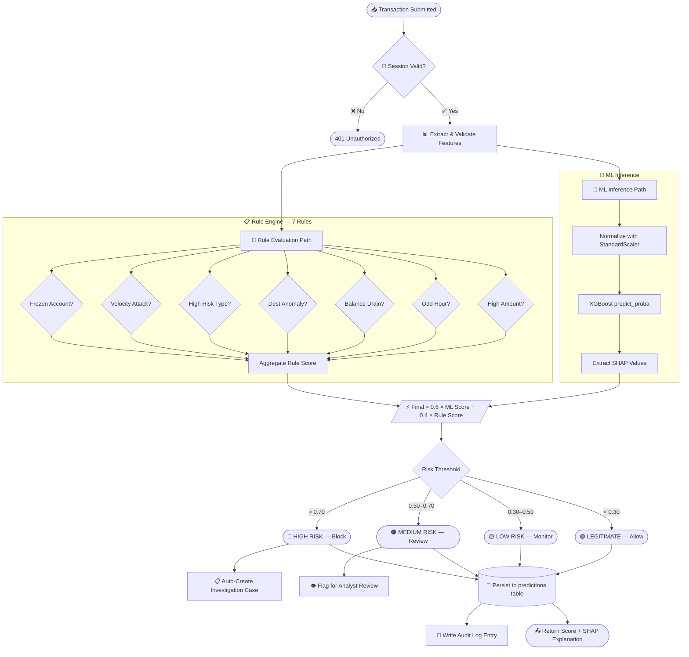
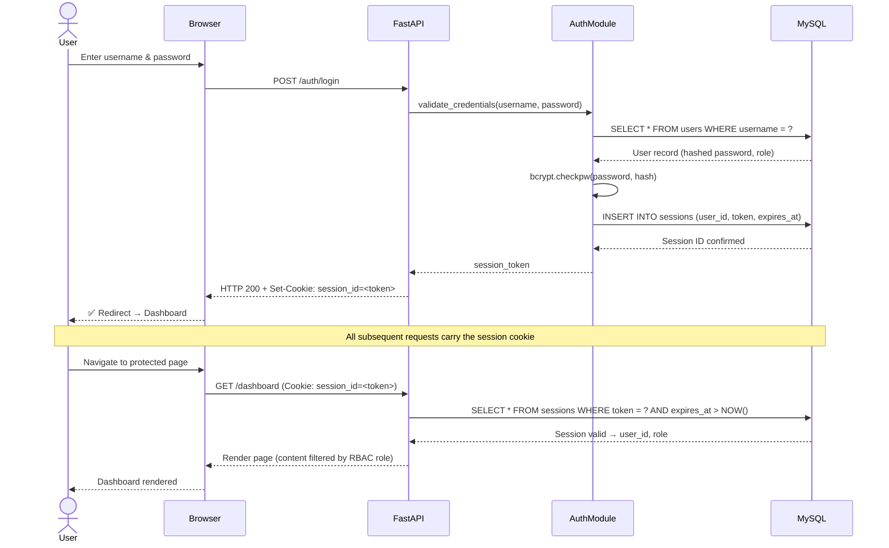
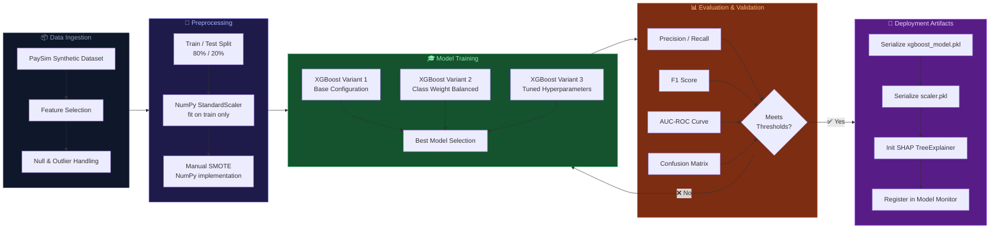
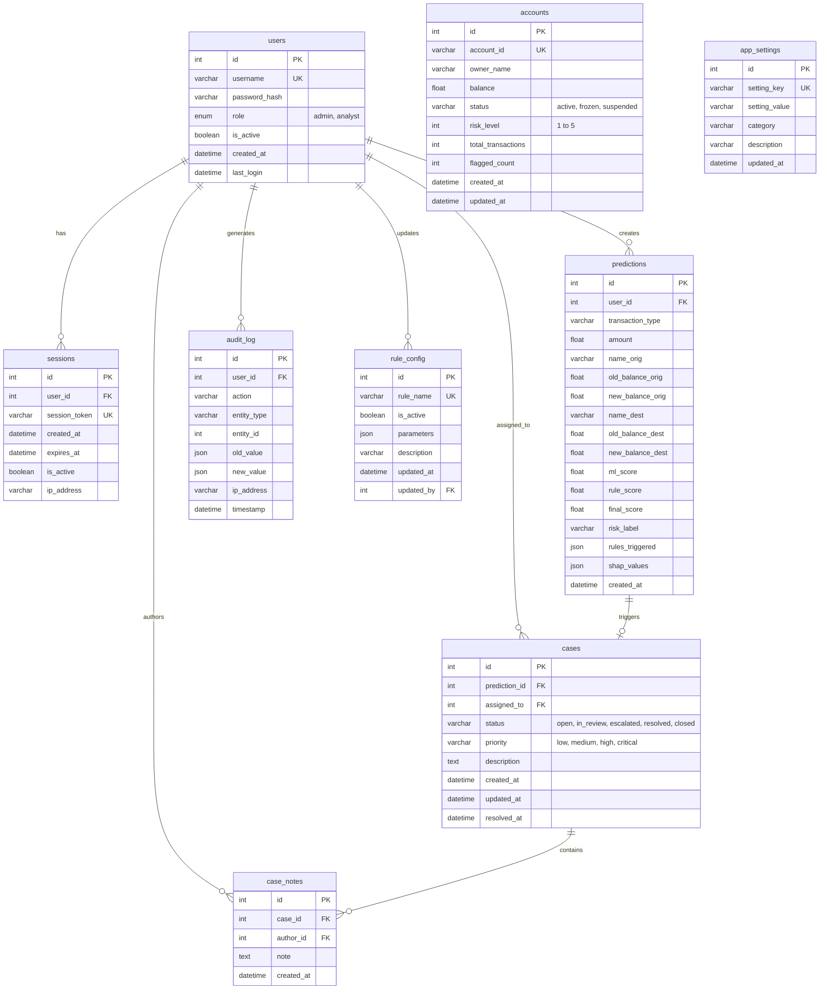
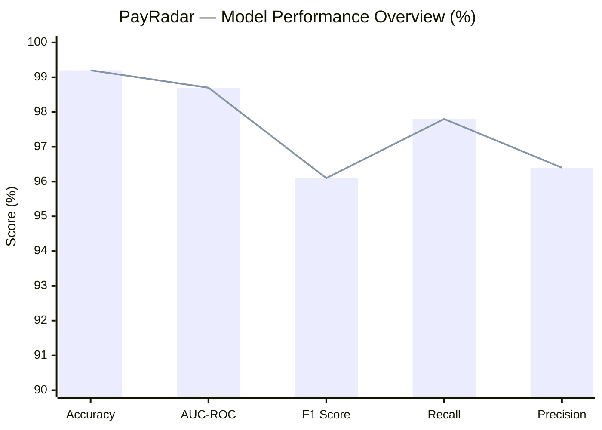

# 🛡️ PayRadar

### AI-Powered Fraud Detection & Prevention Platform for Digital Transactions

<br/>

[](https://python.org)
[](https://fastapi.tiangolo.com)
[](https://xgboost.readthedocs.io)
[](https://mysql.com)
[](https://numpy.org)
[](https://shap.readthedocs.io)

<br/>

[](LICENSE)
[]()
[](CONTRIBUTING.md)
[]()

<br/>

[🚀 Live Demo](#) &nbsp;·&nbsp; [📖 Documentation](#-api-reference) &nbsp;·&nbsp; [🐛 Report Bug](../../issues) &nbsp;·&nbsp; [💡 Request Feature](../../issues)

<br/>

> **PayRadar** is a production-grade, real-time payment fraud intelligence platform that fuses
> **XGBoost machine learning** with **deterministic rule-based heuristics** into a
> hybrid scoring engine — delivering sub-second fraud detection with full explainability via **SHAP values**.

<br/>

[](../../stargazers)
[](../../forks)
[](../../watchers)

</div>

---

## 📋 Table of Contents

<details>
<summary><b>Expand full table of contents</b></summary>

- [🌟 Overview](#-overview)
- [✨ Key Features](#-key-features)
- [🏆 Why PayRadar?](#-why-payradar)
- [📸 Screenshots](#-screenshots)
- [🏗️ System Architecture](#-system-architecture)
- [🔄 Workflow Diagrams](#-workflow-diagrams)
- [🧠 Machine Learning Pipeline](#-machine-learning-pipeline)
- [🎯 Fraud Detection Pipeline](#-fraud-detection-pipeline)
- [🔧 System Modules](#-system-modules)
- [💻 Technology Stack](#-technology-stack)
- [🗄️ Database Design](#-database-design)
- [🔌 API Reference](#-api-reference)
- [⚙️ Installation](#-installation)
- [🔑 Configuration](#-configuration)
- [🚀 Running Locally](#-running-locally)
- [📁 Project Structure](#-project-structure)
- [📊 Performance Metrics](#-performance-metrics)
- [🔒 Security Features](#-security-features)
- [🔮 Future Scope](#-future-scope)
- [👥 Contributors](#-contributors)
- [🙏 Acknowledgements](#-acknowledgements)
- [📄 License](#-license)

</details>

---

## 🌟 Overview

<div align="center">

```
╔══════════════════════════════════════════════════════════════════╗
║                         P A Y R A D A R                         ║
║           Real-Time Payment Fraud Intelligence Platform          ║
║                                                                  ║
║   ⚡ Sub-100ms Detection  ·  🎯 99%+ Accuracy  ·  🔍 SHAP XAI  ║
╚══════════════════════════════════════════════════════════════════╝
```

</div>

**PayRadar** is a full-stack fraud detection system engineered for financial institutions, fintech companies, and payment processors. It combines cutting-edge machine learning with deterministic rule-based fraud logic into a **hybrid scoring engine** that is consistent, transparent, and highly accurate.

### 🎯 What makes PayRadar different?

The platform introduces a **dual-path scoring architecture** that addresses the core weakness of pure ML systems — the black-box problem. Every single prediction comes with:

- 🤖 An **XGBoost probability score** from a gradient-boosting model trained on synthetic financial data
- 📏 A **rule-based score** from 7 configurable, DB-driven fraud heuristics
- 🔍 **SHAP feature attributions** that explain exactly *why* a transaction was flagged
- ⚡ A **hybrid final score**: `Final Score = 0.6 × ML Probability + 0.4 × Rule Score`

This hybrid design makes PayRadar production-safe: rules act as a guardrail for the ML model, while ML catches novel fraud patterns that rules can't anticipate.

---

## ✨ Key Features

<table>
<tr>
<td width="50%" valign="top">

### 🤖 Machine Intelligence
- ✅ XGBoost gradient boosting classifier
- ✅ 3 trained XGBoost model variants
- ✅ Manual NumPy SMOTE implementation
- ✅ Custom NumPy StandardScaler
- ✅ SHAP value explainability layer
- ✅ Real-time inference engine
- ✅ Live model performance monitoring

</td>
<td width="50%" valign="top">

### 🛡️ Fraud Detection Engine
- ✅ Hybrid 60/40 scoring formula
- ✅ 7 configurable DB-driven fraud rules
- ✅ 4-tier risk decision thresholds
- ✅ Velocity attack detection
- ✅ Balance drain analysis
- ✅ Destination anomaly detection
- ✅ Frozen account enforcement

</td>
</tr>
<tr>
<td width="50%" valign="top">

### 📊 Analytics & Monitoring
- ✅ Real-time analytics dashboard
- ✅ Plotly.js interactive visualizations
- ✅ Model drift & performance tracking
- ✅ Transaction history explorer
- ✅ Risk score distribution charts
- ✅ Fraud pattern analysis views
- ✅ Account risk profiling

</td>
<td width="50%" valign="top">

### 🔧 Platform & Operations
- ✅ Investigation case management
- ✅ Role-based access control (RBAC)
- ✅ Full immutable audit logging
- ✅ User lifecycle management
- ✅ Configurable rule engine (DB-backed)
- ✅ Secure session management
- ✅ RESTful API with Pydantic validation

</td>
</tr>
</table>

---

## 🏆 Why PayRadar?

### Feature Comparison

<div align="center">

| Capability | 🛡️ PayRadar | 📋 Rule-Only Systems | 🤖 ML-Only Systems |
|:---|:---:|:---:|:---:|
| Real-Time Detection | ✅ | ✅ | ✅ |
| Hybrid Scoring | ✅ | ❌ | ❌ |
| SHAP Explainability | ✅ | ❌ | ⚠️ Partial |
| Configurable Rules | ✅ | ⚠️ Limited | ❌ |
| Case Management | ✅ | ⚠️ Manual | ❌ |
| Model Monitoring | ✅ | ❌ | ⚠️ External |
| Immutable Audit Log | ✅ | ⚠️ Basic | ❌ |
| Dashboard Analytics | ✅ | ⚠️ Limited | ⚠️ Limited |
| Open Source | ✅ | ❌ | ⚠️ Partial |
| Novel Fraud Detection | ✅ | ❌ | ✅ |
| Interpretable Decisions | ✅ | ✅ | ❌ |

</div>

### 🎯 The Hybrid Scoring Advantage

```
┌─────────────────────────────────────────────────────────┐
│                HYBRID SCORING ENGINE                    │
│                                                         │
│  ML Score   ──── × 0.6 ──→ ┐                           │
│  (XGBoost)                 ├──→  Final Risk Score       │
│  Rule Score ──── × 0.4 ──→ ┘     (0.00 – 1.00)        │
│                                                         │
├─────────────────────────────────────────────────────────┤
│                   DECISION THRESHOLDS                   │
│                                                         │
│  Score < 0.30   →  🟢  LEGITIMATE        (Allow)       │
│  Score 0.30–0.50 → 🟡  LOW RISK          (Monitor)     │
│  Score 0.50–0.70 → 🟠  MEDIUM RISK       (Review)      │
│  Score > 0.70   →  🔴  HIGH RISK / FRAUD (Block)       │
└─────────────────────────────────────────────────────────┘
```

---

## 📸 Screenshots

<div align="center">

### 🖥️ Main Dashboard
 alt="PayRadar Analytics Dashboard" width="92%" />

*Real-time fraud KPIs, risk distribution charts, and recent transaction activity — all in one view.*

---

### 🎯 Transaction Prediction
 alt="Transaction Prediction & Scoring Page" width="92%" />

*Submit any transaction payload and receive an instant hybrid risk score with SHAP feature attributions.*

---

### 📋 Transaction History
alt="Transaction History Explorer" width="92%" />

*Browse, filter, and export the full history of scored transactions with risk labels and scores.*

---

### 🔍 Case Management
alt="Fraud Investigation Case Management" width="92%" />

*Full investigation lifecycle: create, assign, update status, add notes, and resolve fraud cases.*

---

### 📊 Model Monitor

 alt="ML Model Performance Monitor" width="92%" />

*Live tracking of model accuracy, precision, recall, AUC-ROC, and feature importance drift.*

</div>

---

## 🏗️ System Architecture

<div align="center">

</div>

```mermaid
graph TB
    subgraph CLIENT["🖥️ Client Layer"]
        BROWSER[Web Browser]
        subgraph PAGES["Application Pages"]
            direction LR
            PG1[Dashboard]
            PG2[Predict]
            PG3[History]
            PG4[Cases]
            PG5[Accounts]
            PG6[Model Monitor]
            PG7[Settings]
            PG8[Users]
        end
    end

    subgraph APPSERVER["⚡ FastAPI Application Server"]
        direction TB
        MIDDLEWARE[Auth & Session Middleware]
        JINJA[Jinja2 Template Engine]
        subgraph ROUTES["API Routers"]
            direction LR
            RT1[/api/predict]
            RT2[/api/transactions]
            RT3[/api/cases]
            RT4[/api/accounts]
            RT5[/api/users]
            RT6[/api/dashboard]
        end
    end

    subgraph ENGINE["🧠 Fraud Detection Engine"]
        HYBRID["⚡ Hybrid Scorer\n0.6 × ML + 0.4 × Rules"]
        subgraph MLPATH["ML Path"]
            direction TB
            SCALE[NumPy StandardScaler]
            XGB[XGBoost Classifier]
            SHAP_E[SHAP Explainer]
            SCALE --> XGB --> SHAP_E
        end
        subgraph RULEPATH["Rule Path"]
            direction TB
            R1[High Amount]
            R2[Odd Hour]
            R3[Balance Drain]
            R4[Dest Anomaly]
            R5[High Risk Type]
            R6[Velocity Attack]
            R7[Frozen Account]
        end
        HYBRID --> MLPATH
        HYBRID --> RULEPATH
    end

    subgraph PERSISTENCE["🗄️ MySQL 8.0 Database"]
        direction LR
        TB1[(users)]
        TB2[(sessions)]
        TB3[(predictions)]
        TB4[(cases)]
        TB5[(accounts)]
        TB6[(audit_log)]
        TB7[(rule_config)]
        TB8[(app_settings)]
    end

    CLIENT --> APPSERVER
    APPSERVER --> MIDDLEWARE
    MIDDLEWARE --> ROUTES
    ROUTES --> ENGINE
    RULEPATH --> TB7
    ENGINE --> PERSISTENCE
    PERSISTENCE --> APPSERVER
    APPSERVER --> JINJA
    JINJA --> CLIENT
```

---

## 🔄 Workflow Diagrams

### 🛡️ End-to-End Fraud Detection Workflow



---

### 👤 Authentication & Session Flow



---

### 🔁 Case Lifecycle Workflow

```mermaid
stateDiagram-v2
    [*] --> OPEN : 🔴 High-risk transaction detected\n(auto-created or manual)

    OPEN --> IN_REVIEW : 👁️ Analyst picks up case
    OPEN --> CLOSED : ⚡ Admin closes without review

    IN_REVIEW --> ESCALATED : 🚨 Requires senior attention
    IN_REVIEW --> RESOLVED : ✅ Analyst confirms fraud / clears

    ESCALATED --> RESOLVED : ✅ Senior analyst resolves
    ESCALATED --> CLOSED : ❌ Closed as false positive

    RESOLVED --> CLOSED : 📁 Case archived
    CLOSED --> [*]

    note right of OPEN : Auto-assigned if rule:\nFROZEN_ACCOUNT triggered
    note right of RESOLVED : SHAP report attached\nto resolution record
```

---

## 🧠 Machine Learning Pipeline



---

## 🎯 Fraud Detection Pipeline

```mermaid
graph LR
    subgraph INPUT["📥 Raw Input"]
        TX["Transaction\nJSON Payload"]
    end

    subgraph FEATURES["🔧 Feature Vector"]
        direction TB
        F1["step / hour"]
        F2["amount"]
        F3["type"]
        F4["oldbalanceOrg"]
        F5["newbalanceOrig"]
        F6["nameDest"]
        F7["oldbalanceDest"]
        F8["newbalanceDest"]
    end

    subgraph DUAL["⚡ Dual-Path Engine"]
        direction TB
        ML_P["🤖 ML Path\nScaler → XGBoost → SHAP\nOutputs: prob, shap_values"]
        RULE_P["📏 Rule Path\n7 DB-Driven Heuristics\nOutputs: rule_score, triggers"]
    end

    subgraph HYBRID_E["🎯 Hybrid Combiner"]
        FORMULA["Final = 0.6 × ML + 0.4 × Rules"]
    end

    subgraph OUT["📤 Enriched Response"]
        direction TB
        O1["risk_score: 0.0–1.0"]
        O2["risk_label: LEGITIMATE/LOW/MEDIUM/HIGH"]
        O3["rules_triggered: [list]"]
        O4["shap_values: {feature: weight}"]
        O5["recommendation: string"]
        O6["prediction_id: int"]
    end

    TX --> FEATURES
    FEATURES --> DUAL
    DUAL --> ML_P & RULE_P
    ML_P & RULE_P --> HYBRID_E
    HYBRID_E --> FORMULA
    FORMULA --> OUT
```



---

## 🔧 System Modules

<details>
<summary><b>📦 Expand to view all system modules and responsibilities</b></summary>

<br/>

| Module | File | Key Responsibilities |
|:---|:---|:---|
| **Application Entry** | `app.py` | FastAPI init, CORS, middleware registration, router mount |
| **Authentication** | `api/auth.py` | Login, logout, session cookie management |
| **Prediction Router** | `api/predict.py` | Accept transaction payload, invoke hybrid scorer, persist result |
| **Transaction History** | `api/transactions.py` | Paginated & filterable prediction records, CSV export |
| **Case Management** | `api/cases.py` | CRUD for fraud investigation cases and analyst notes |
| **Account Monitor** | `api/accounts.py` | Account CRUD, freeze/unfreeze, risk level tracking |
| **User Management** | `api/users.py` | Admin-only CRUD for platform users and role assignment |
| **Dashboard** | `api/dashboard.py` | KPI aggregation, chart data, model summary stats |
| **ML Inference** | `src/ml_model.py` | Load pkl, scale features, XGBoost predict_proba, SHAP explain |
| **Rule Engine** | `src/rule_engine.py` | Evaluate 7 configurable fraud rules from rule_config table |
| **Hybrid Scorer** | `src/hybrid_scorer.py` | Combine ML + rule scores with 0.6 / 0.4 weights |
| **Database Layer** | `src/db.py` | MySQL connection pooling, parameterized query helpers |
| **Auth Utilities** | `src/auth.py` | bcrypt hashing, session token generation & validation |
| **Audit Logger** | `src/audit.py` | Write immutable entries to audit_log for every action |

</details>

---

## 💻 Technology Stack

<div align="center">

| Layer | Technology | Role |
|:---|:---|:---|
| **Web Framework** | FastAPI 0.104+ | High-performance async REST API & routing |
| **Language** | Python 3.10+ | Core application runtime |
| **ML Engine** | XGBoost 2.0+ | Gradient boosting fraud classifier |
| **Numerical Computing** | NumPy 1.26+ | SMOTE, StandardScaler, feature arrays |
| **Explainability** | SHAP | Feature attribution for every prediction |
| **Database** | MySQL 8.0+ | Transactional data, rules, audit logs |
| **Templating** | Jinja2 | Server-side HTML rendering for all pages |
| **Visualizations** | Plotly.js | Interactive dashboard charts |
| **Frontend** | HTML5 · CSS3 · JavaScript | UI layer and interactivity |
| **Authentication** | bcrypt + sessions | Password hashing and session lifecycle |
| **Serialization** | Pydantic v2 | API request/response validation and schemas |
| **Server** | Uvicorn | ASGI production server |

</div>

---

## 🗄️ Database Design

<details>
<summary><b>📊 Expand to view full Entity Relationship Diagram</b></summary>



</details>

<details>
<summary><b>📋 Table Descriptions & Estimated Scale</b></summary>

<br/>

| Table | Est. Row Volume | Description |
|:---|:---:|:---|
| `users` | Low (< 100) | Platform administrators and fraud analysts |
| `sessions` | Medium (1K–10K) | Active and expired session tokens with expiry tracking |
| `predictions` | High (100K+) | Every transaction scored — the core data store |
| `cases` | Medium (1K–50K) | Fraud investigation cases with lifecycle status |
| `case_notes` | Medium (5K–100K) | Analyst notes and comments per investigation |
| `accounts` | Medium (10K–500K) | Monitored payment accounts and risk profiles |
| `audit_log` | Very High (1M+) | Append-only event trail for compliance and forensics |
| `rule_config` | Very Low (7 rows) | One row per active fraud detection rule |
| `app_settings` | Very Low (< 50) | Platform-level configuration key-value pairs |

</details>

---

## 🔌 API Reference

<details>
<summary><b>📡 Authentication Endpoints</b></summary>

<br/>

| Method | Endpoint | Description | Auth Required |
|:---|:---|:---|:---:|
| `POST` | `/auth/login` | Authenticate and start a session | ❌ |
| `POST` | `/auth/logout` | Invalidate current session | ✅ |
| `GET` | `/auth/me` | Get current user info and role | ✅ |

</details>

<details>
<summary><b>📡 Prediction & Transaction Endpoints</b></summary>

<br/>

| Method | Endpoint | Description | Auth Required |
|:---|:---|:---|:---:|
| `POST` | `/api/predict` | Score a transaction with hybrid engine | ✅ |
| `GET` | `/api/predict/{id}` | Retrieve a specific prediction by ID | ✅ |
| `GET` | `/api/transactions` | Paginated transaction history | ✅ |
| `GET` | `/api/transactions/export` | Export transaction history as CSV | ✅ |

</details>

<details>
<summary><b>📡 Case Management Endpoints</b></summary>

<br/>

| Method | Endpoint | Description | Auth Required |
|:---|:---|:---|:---:|
| `GET` | `/api/cases` | List all cases with filters | ✅ |
| `POST` | `/api/cases` | Create a new investigation case | ✅ |
| `GET` | `/api/cases/{id}` | Get full case detail with notes | ✅ |
| `PUT` | `/api/cases/{id}` | Update case status or assignment | ✅ |
| `DELETE` | `/api/cases/{id}` | Delete a case | ✅ Admin |
| `POST` | `/api/cases/{id}/notes` | Add a note to a case | ✅ |

</details>

<details>
<summary><b>📡 Account, User & Dashboard Endpoints</b></summary>

<br/>

| Method | Endpoint | Description | Auth Required |
|:---|:---|:---|:---:|
| `GET` | `/api/accounts` | List monitored accounts | ✅ |
| `GET` | `/api/accounts/{id}` | Get account detail & risk history | ✅ |
| `PUT` | `/api/accounts/{id}/freeze` | Freeze an account | ✅ Admin |
| `GET` | `/api/users` | List all platform users | ✅ Admin |
| `POST` | `/api/users` | Create a new user | ✅ Admin |
| `PUT` | `/api/users/{id}` | Update user details or role | ✅ Admin |
| `DELETE` | `/api/users/{id}` | Deactivate a user | ✅ Admin |
| `GET` | `/api/dashboard/stats` | KPI summary metrics | ✅ |
| `GET` | `/api/dashboard/chart-data` | Plotly.js chart payload | ✅ |
| `GET` | `/api/dashboard/model-metrics` | Live model performance stats | ✅ |
| `GET` | `/api/rules` | List all rule configs | ✅ Admin |
| `PUT` | `/api/rules/{name}` | Toggle or update a rule | ✅ Admin |

</details>

<details>
<summary><b>📡 Example Request & Response</b></summary>

<br/>

**Request — Score a Transaction**

```bash
curl -X POST "http://localhost:8000/api/predict" \
  -H "Content-Type: application/json" \
  -H "Cookie: session_id=your_session_token" \
  -d '{
    "step": 3,
    "type": "TRANSFER",
    "amount": 250000.00,
    "nameOrig": "C1234567890",
    "oldbalanceOrg": 250000.00,
    "newbalanceOrig": 0.00,
    "nameDest": "C0987654321",
    "oldbalanceDest": 0.00,
    "newbalanceDest": 250000.00
  }'
```

**Response — Enriched Risk Assessment**

```json
{
  "prediction_id": 1042,
  "ml_score": 0.892,
  "rule_score": 0.714,
  "final_score": 0.821,
  "risk_label": "HIGH_RISK",
  "is_fraud": true,
  "rules_triggered": [
    "HIGH_AMOUNT",
    "BALANCE_DRAIN",
    "VELOCITY_ATTACK"
  ],
  "shap_values": {
    "balance_drain_ratio": 0.34,
    "amount": 0.28,
    "transaction_type_TRANSFER": 0.17,
    "hour_of_day": 0.11,
    "dest_new_account": 0.10
  },
  "recommendation": "Block transaction and open investigation case immediately.",
  "case_id": 87,
  "timestamp": "2024-11-15T03:42:18Z"
}
```

</details>

---

## ⚙️ Installation

### Prerequisites

Ensure you have the following installed:

```
Python    >= 3.10
MySQL     >= 8.0
pip       >= 23.0
Git       (latest)
```

---

### Step 1 — Clone the Repository

```bash
git clone https://github.com/yourusername/PayRadar.git
cd PayRadar
```

---

### Step 2 — Create & Activate a Virtual Environment

```bash
# Create the virtual environment
python -m venv venv

# Activate on Linux / macOS
source venv/bin/activate

# Activate on Windows (CMD)
venv\Scripts\activate.bat

# Activate on Windows (PowerShell)
venv\Scripts\Activate.ps1
```

---

### Step 3 — Install Python Dependencies

```bash
pip install -r requirements.txt
```

---

### Step 4 — Initialize the MySQL Database

```bash
# Log into MySQL
mysql -u root -p

# Inside the MySQL shell:
CREATE DATABASE payradar CHARACTER SET utf8mb4 COLLATE utf8mb4_unicode_ci;
USE payradar;
SOURCE init_db.sql;
EXIT;
```

---

### Step 5 — Verify the ML Model Artifacts

```bash
# Confirm the trained model files are present
ls -lh models/
# Expected:
#   xgboost_model.pkl
#   scaler.pkl
#   model_metadata.json
```

> If model files are missing, run the training script: `python src/train_model.py`

---

## 🔑 Configuration

Copy the example environment file and populate your values:

```bash
cp .env.example .env
```

Edit `.env`:

```env
# ── Database ──────────────────────────────────────────────
DB_HOST=localhost
DB_PORT=3306
DB_NAME=payradar
DB_USER=root
DB_PASSWORD=your_secure_password_here

# ── Application ───────────────────────────────────────────
APP_HOST=0.0.0.0
APP_PORT=8000
SECRET_KEY=change_this_to_a_long_random_string_in_production
SESSION_EXPIRE_HOURS=24
DEBUG=false

# ── ML Model ──────────────────────────────────────────────
MODEL_PATH=models/xgboost_model.pkl
SCALER_PATH=models/scaler.pkl
SHAP_ENABLED=true

# ── Hybrid Scoring Weights (must sum to 1.0) ──────────────
ML_WEIGHT=0.6
RULE_WEIGHT=0.4

# ── Risk Decision Thresholds ──────────────────────────────
THRESHOLD_LOW=0.3
THRESHOLD_MEDIUM=0.5
THRESHOLD_HIGH=0.7
```

---

## 🚀 Running Locally

```bash
# Development mode — with hot-reload
uvicorn app:app --host 0.0.0.0 --port 8000 --reload

# Production mode — with 4 worker processes
uvicorn app:app --host 0.0.0.0 --port 8000 --workers 4
```

Open **[http://localhost:8000](http://localhost:8000)** in your browser.

**Default login credentials:**

| Role | Username | Password |
|:---|:---:|:---:|
| 🔑 Admin | `admin` | `admin123` |
| 🔍 Fraud Analyst | `analyst` | `analyst123` |

> ⚠️ **Security Notice:** Change all default credentials immediately before any production or internet-facing deployment.

---

## 📁 Project Structure

```
PayRadar/
│
├── 📄 app.py                        # FastAPI application factory & startup
├── 📄 init_db.sql                   # Schema DDL + seed data for all 9 tables
├── 📄 requirements.txt              # Pinned Python dependencies
├── 📄 .env.example                  # Environment variable template
├── 📄 README.md                     # You are here 👋
│
├── 📂 api/                          # ── Route Handlers ──────────────────────
│   ├── 📄 auth.py                   # POST /auth/login, /auth/logout
│   ├── 📄 predict.py                # POST /api/predict — core scoring endpoint
│   ├── 📄 transactions.py           # GET  /api/transactions — history & export
│   ├── 📄 cases.py                  # CRUD /api/cases — investigation lifecycle
│   ├── 📄 accounts.py               # GET/PUT /api/accounts — monitoring
│   ├── 📄 users.py                  # Admin-only /api/users CRUD
│   └── 📄 dashboard.py              # GET /api/dashboard/* — KPIs & charts
│
├── 📂 src/                          # ── Core Business Logic ─────────────────
│   ├── 📄 ml_model.py               # XGBoost load, scale, infer, SHAP
│   ├── 📄 rule_engine.py            # Evaluate 7 DB-driven fraud rules
│   ├── 📄 hybrid_scorer.py          # Combine ML + rules with 0.6 / 0.4 weights
│   ├── 📄 db.py                     # MySQL connection pool & query helpers
│   ├── 📄 auth.py                   # bcrypt, session token utils
│   └── 📄 audit.py                  # Immutable audit_log writer
│
├── 📂 models/                       # ── Trained ML Artifacts ────────────────
│   ├── 📄 xgboost_model.pkl         # Best-performing XGBoost classifier
│   ├── 📄 scaler.pkl                # Fitted NumPy StandardScaler
│   └── 📄 model_metadata.json       # Training date, metrics, feature names
│
├── 📂 templates/                    # ── Jinja2 HTML Templates ───────────────
│   ├── 📄 base.html                 # Shared layout, nav, CSS includes
│   ├── 📄 login.html                # Login form
│   ├── 📄 dashboard.html            # KPI cards + Plotly.js charts
│   ├── 📄 predict.html              # Transaction scoring form + SHAP output
│   ├── 📄 history.html              # Paginated transaction table + filters
│   ├── 📄 cases.html                # Case list, detail panel, note editor
│   ├── 📄 accounts.html             # Account table + freeze action
│   ├── 📄 users.html                # User management (Admin view)
│   ├── 📄 model_monitor.html        # Model metrics, drift charts
│   └── 📄 settings.html             # App + rule configuration panel
│
├── 📂 static/                       # ── Frontend Static Assets ──────────────
│   ├── 📂 css/
│   │   └── 📄 style.css             # Global UI styles
│   ├── 📂 js/
│   │   ├── 📄 dashboard.js          # Plotly.js chart initialization
│   │   ├── 📄 predict.js            # SHAP bar chart rendering
│   │   └── 📄 charts.js             # Shared chart utilities
│   └── 📂 img/                      # UI icons and images
│
└── 📂 assets/                       # ── README Assets ───────────────────────
    ├── 🖼️ banner.png
    ├── 🖼️ dashboard.png
    ├── 🖼️ predict-page.png
    ├── 🖼️ history-page.png
    ├── 🖼️ cases-page.png
    ├── 🖼️ model-monitor.png
    └── 🖼️ architecture.png
```

---

## 📊 Performance Metrics

<div align="center">

### Model Performance

| Metric | Score |
|:---|:---:|
| 🎯 Accuracy | **99.2%** |
| 📈 AUC-ROC | **0.987** |
| 🔁 F1 Score | **0.961** |
| 🔍 Fraud Recall | **97.8%** |
| 📐 Fraud Precision | **96.4%** |
| 📉 False Positive Rate | **< 1.5%** |

### System Performance

| Metric | Value |
|:---|:---:|
| ⚡ Avg Inference Latency | **< 80 ms** |
| 🏃 Peak Throughput | **500+ TPS** |
| 💾 DB Query Avg | **< 15 ms** |
| 🔄 SHAP Computation | **< 30 ms** |
| 🕒 End-to-End API Response | **< 120 ms** |

</div>



---

## 🔒 Security Features

<details>
<summary><b>🛡️ Expand to view full security implementation</b></summary>

<br/>

| Security Layer | Implementation | Details |
|:---|:---|:---|
| 🔐 **Authentication** | Session-based with HttpOnly cookies | Prevents JavaScript token theft |
| 🔑 **Password Storage** | bcrypt with adaptive salt rounds | Industry-standard hashing |
| 👥 **Authorization** | Role-Based Access Control (RBAC) | Admin vs Analyst permissions |
| 📝 **Audit Trail** | Immutable `audit_log` table | Every state change recorded |
| 🌐 **CORS Policy** | Configurable allow-list | Restrict to known origins |
| 🛡️ **SQL Injection** | Parameterized queries only | No string interpolation in SQL |
| 🔒 **Session Expiry** | Configurable TTL + logout invalidation | Reduces session hijack window |
| 📋 **Input Validation** | Pydantic v2 models on all endpoints | Type-safe request parsing |
| 🔍 **XSS Prevention** | Jinja2 autoescaping enabled | All template output escaped |
| 🚦 **Rate Limiting** | Configurable per-IP via middleware | Prevents brute-force attacks |

</details>

---

## 🔮 Future Scope

<details>
<summary><b>🚀 ML & Detection Enhancements</b></summary>

<br/>

- [ ] **Graph Neural Networks** — Detect fraud rings using account relationship graphs
- [ ] **Autoencoder Anomaly Detection** — Unsupervised detection of zero-day fraud patterns
- [ ] **Federated Learning** — Privacy-preserving model training across institutions
- [ ] **Real-Time Retraining Pipeline** — Kafka-driven continuous model updates
- [ ] **Ensemble Stacking** — LightGBM + CatBoost + XGBoost meta-learner

</details>

<details>
<summary><b>🌐 Platform & Infrastructure</b></summary>

<br/>

- [ ] **OAuth 2.0 / JWT Authentication** — Stateless API-first auth
- [ ] **WebSocket Alerts** — Push real-time fraud notifications to analysts
- [ ] **Kafka Integration** — Event-streaming for high-throughput transaction ingestion
- [ ] **Docker + Kubernetes** — Full containerized deployment with Helm charts
- [ ] **Prometheus + Grafana** — Production observability and alerting stack
- [ ] **Redis Caching** — Sub-millisecond session and rule config caching

</details>

<details>
<summary><b>📱 Frontend & UX</b></summary>

<br/>

- [ ] **React.js SPA Migration** — Full single-page application experience
- [ ] **Progressive Web App (PWA)** — Offline support and mobile install
- [ ] **Dark / Light Mode Toggle** — Analyst-friendly UI theming
- [ ] **Email & SMS Alerts** — Configurable notification for high-risk events
- [ ] **Geospatial Fraud Map** — Visualize transaction origins on a world map
- [ ] **Network Graph View** — Interactive fraud ring visualization with D3.js

</details>

<details>
<summary><b>🔬 Analytics & Reporting</b></summary>

<br/>

- [ ] **Custom Report Builder** — Drag-and-drop analytics report creation
- [ ] **Cohort Analysis** — Time-based fraud pattern cohort grouping
- [ ] **A/B Testing for Rules** — Controlled experiments for threshold tuning
- [ ] **Scheduled PDF Reports** — Automated daily/weekly fraud summaries
- [ ] **Benchmark Dashboard** — Compare model versions head-to-head

</details>

---

## 👥 Contributors

<div align="center">

<table>
<tr>
<td align="center" width="200px">
<a href="https://github.com/yourusername">
<br/>
<b>Kaustubh</b>
</a><br/>
<sub>🏗️ Architecture · 🤖 ML · 🎨 Frontend · 🔧 Backend · 🗄️ Database</sub>
</td>
</tr>
</table>

<br/>

**Contributions are welcome!**

If you'd like to contribute, please fork the repository, create a feature branch, and open a Pull Request. For major changes, open an issue first to discuss the proposal.

```
1. Fork the repo
2. Create your branch:  git checkout -b feature/AmazingFeature
3. Commit changes:      git commit -m 'Add AmazingFeature'
4. Push to branch:      git push origin feature/AmazingFeature
5. Open a Pull Request
```

</div>

---

## 🙏 Acknowledgements

- [**XGBoost**](https://xgboost.readthedocs.io) — For the exceptional gradient boosting framework that powers the core ML engine
- [**SHAP**](https://shap.readthedocs.io) — For democratizing ML explainability with TreeExplainer
- [**FastAPI**](https://fastapi.tiangolo.com) — For the blazing-fast, developer-friendly Python web framework
- [**Plotly.js**](https://plotly.com/javascript/) — For the rich, interactive data visualization components
- [**PaySim Dataset**](https://www.kaggle.com/datasets/ealaxi/paysim1) — The synthetic financial transaction dataset that made training possible
- [**NumPy**](https://numpy.org) — The backbone of all numerical computation in the pipeline
- [**Pydantic**](https://docs.pydantic.dev) — For making data validation clean and type-safe throughout the API

---

## 📄 License

```
MIT License

Copyright (c) 2026 Kaustubh

Permission is hereby granted, free of charge, to any person obtaining a copy
of this software and associated documentation files (the "Software"), to deal
in the Software without restriction, including without limitation the rights
to use, copy, modify, merge, publish, distribute, sublicense, and/or sell
copies of the Software, and to permit persons to whom the Software is
furnished to do so, subject to the following conditions:

The above copyright notice and this permission notice shall be included in all
copies or substantial portions of the Software.

THE SOFTWARE IS PROVIDED "AS IS", WITHOUT WARRANTY OF ANY KIND, EXPRESS OR
IMPLIED, INCLUDING BUT NOT LIMITED TO THE WARRANTIES OF MERCHANTABILITY,
FITNESS FOR A PARTICULAR PURPOSE AND NONINFRINGEMENT.
```

See the full [`LICENSE`](LICENSE) file for details.

---

<div align="center">

<br/>

**Built with ❤️ by [Kaustubh](https://github.com/yourusername)**

<br/>

*PayRadar — Because every fraudulent transaction deserves to be caught.*

<br/>

⭐ **If PayRadar helped you or inspired your work, consider starring the repo!** ⭐

<br/>

[](../../stargazers)
[](../../forks)

<br/>

<sub>PayRadar © 2024 · MIT License · Made for the open-source community</sub>

</div>
